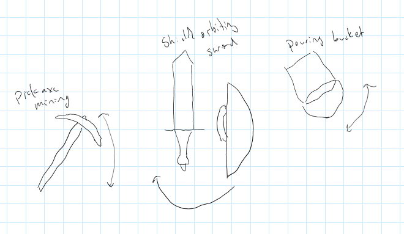
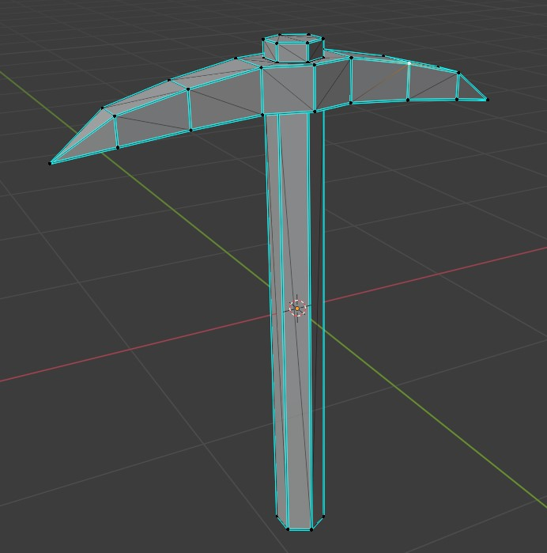
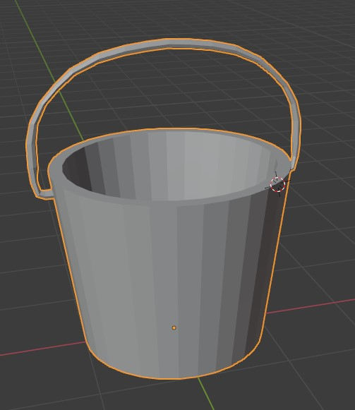

# Project Three - Kyle Shepard

## [main.cpp](./src/main.cpp)
Four objects reminiscent of Minecraft (although a bit more realistic) in a Minecraft panorama image I made.

[Demo](https://youtu.be/j4QbuaO8ZJc)

## Diagram

## Screenshots
### Pickaxe

### Bucket

### Shield

### Sword (followed from Blender tutorial, hence the three other objects)
[Tutorial Link]()

